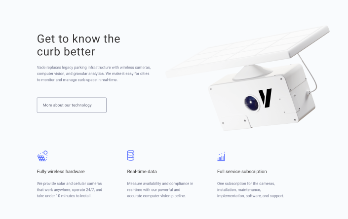

# web-lab1-bem

# голова голова__нос голова__нос--пирсинг
# голова голова__уши голова__уши--кольцо
# голова голова__волосы голова__уши--белые

# тело тело__правая-рука тело__правая-рука--татуировка
# тело тело__левая-рука тело__левая-рука--браслет
# тело тело__левая-нога тело__левая-нога--белый-носок

# ноги ноги__колено ноги__колено--наколенник
# ноги ноги__голени ноги__голени--щитки(футбольные)
# ноги ноги__ступни ноги__ступни--носки

header.header>img.logo+nav.nav>ul.nav__list>li.nav__item>a.nav__link*6

section.post>p.post__title+(ul.post__list>li.post__item*3>img.post__item__img+p.post__item__decription)+a.post__link

form.form>(div.form__field>label.form__label[for=$]+input.form__input[type=$][name=$][required])*5+(textarea.form__input.form__input--textarea[name=$][required])+button.form__button[type=submit]

section.about>(.about__info>h2.about__title+p.about__description+a.about__link)+img.about__img+ul.about__list>li.about__item*3>img.about__item__img+h3.about__item__title+p.about__item__description